I was checking old notes from my phone this week and found a little note about how I nurture my relationship with my time and how I create satisfying meaningful moments. This simple note brought me to a long AI conversation and reflections on how we can apply economic thinking to our most finite resource: **time**.

> Time is money? Nope.

Unlike money, which can be earned back, or energy, which can be restored through rest, time moves in only one direction. Once spent, it's gone forever. Yet most of us treat time more carelessly than we treat money, making decisions without considering the true cost or return on our temporal investments.

## The Time Economics Framework

**Time Economics** treats time as your most valuable, non-renewable resource that can be invested, spent, or valued for its present worth. This framework borrows from financial economics but recognizes that time has unique properties that require specialized thinking.



Different organisms experience and interact with time on vastly different scales. Understanding these ranges gives us perspective on our own temporal existence:

| Organism/Entity | Time Scale Range | Notable Characteristics |
|----------------|------------------|------------------------|
| 🦠 Bacteria | Milliseconds - Hours | • Cell division every 20 mins (E. coli)<br>• Rapid metabolic responses<br>• Quick generational turnover |
| 🐜 Insects | Minutes - Months | • Mayflies live 24 hours as adults<br>• Ant colonies persist for decades<br>• Cicadas emerge every 13-17 years |
| 🌱 Plants | Hours - Millennia | • Venus flytraps snap in 1/10 second<br>• Bamboo flowers once every 65-120 years<br>• Bristlecone pines live 5000+ years |
| 🦊 Mammals | Hours - Decades | • Mice live 2-3 years<br>• Humans ~80 years<br>• Bowhead whales 200+ years |
| 🗻 Geological | Millennia - Eons | • Mountain formation: millions of years<br>• Continental drift: cm/year<br>• Earth's age: 4.5 billion years |

This spectrum reminds us that "time" is relative to the observer. While we often fixate on human timescales (days/weeks/years), nature operates across a much broader temporal canvas. If you like spectrums, also see [Paradoxical Spectrums of Dev Life](/2025/04/23/paradoxical-spectrums-of-dev-life/) for how to navigate competing tensions in software development. 



### Core Resource Types

**Invest time** in activities that compound over time:
- Learning new skills that multiply your capabilities
- Building relationships that deepen and strengthen
- Developing systems that automate future decisions
- Improving health that extends and enhances future time
- Creating assets (knowledge, tools, content) that provide ongoing value

**Spend time** on immediate consumption and necessary maintenance:
- Entertainment and relaxation that restore your energy
- Social connection that fulfills present emotional needs
- Rest and recovery that maintain your baseline functioning
- Spontaneous experiences that create memories and joy

**Present value** - recognizing the inherent worth of current experience:
- Being fully present with loved ones
- Experiencing beauty, wonder, or transcendence
- Moments of flow state and deep engagement
- Peak experiences that can't be replicated later

## The Three Core Metrics for Time Optimization

When optimizing time, we're not seeking a perfect balance or creating an aging plan. Instead, we're developing a framework to evaluate each moment and decision through three critical lenses that help us understand the true value of our temporal choices:


### Future Value Activities

What future value does this hour create? This isn't just about career advancement or skill building. Future value activities include:

- **Skill Compounding:** An hour learning a foundational concept may pay dividends for years
- **Relationship Investment:** Time spent deepening a friendship creates ongoing emotional returns
- **System Building:** An hour automating a routine task saves minutes every day going forward
- **Health Investment:** Exercise today reduces future medical time and increases available energy

**Example:** Spending 2 hours on Sunday meal prepping saves 30 minutes daily during the week (2.5 hours total) while improving nutrition. The future value is 25% time savings plus health benefits.

### Present Value Activities

What meaning, joy, or fulfillment does this moment provide right now? Some experiences can't be deferred or optimized—they must be experienced in the present.

- **Irreplaceable Moments:** Your child's first steps happen once
- **Peak Experiences:** A sunset, a great conversation, a moment of insight
- **Flow States:** When you're fully absorbed and time seems to stop
- **Connection:** Deep presence with another person

**Example:** Playing with your child may not have obvious future value, but the present value is enormous—these moments create the fabric of relationship and can't be recovered later.

### Authorshipmetry

> Am I writing my story this hour, or am I just a character in someone else's?

**Authorshipmetry** measures the degree to which you're actively creating your time narrative versus being written into someone else's story. This metric helps you understand not just what you're doing, but who's deciding what you do.

Unlike future value and present value (which measure what you get from time), authorshipmetry measures who controls the pen that writes your story.

**High Authorship:** You're the writer of your time
- Crafting your day with intention and purpose
- Making plot decisions that align with your life's story arc
- Choosing which scenes (activities) deserve your attention

**Medium Authorship:** Co-writing or editing someone else's draft
- You have input but within someone else's framework
- Adding your voice to collaborative stories (work projects, family time)
- Making micro-choices that shape how the scene plays out

**Low Authorship:** You're just reading lines someone else wrote
- Following scripts written by others
- Emergency responses where you're reacting, not creating
- Being moved by external plot forces

The goal isn't to maximize authorship at all costs, but to be intentional about when you're trading narrative control for other story benefits (security, relationships, social contribution).

**Measuring Authorshipmetry:**

```
[10] █████████████████████ Complete narrative control
[9]  ██████████████████    High influence, loose constraints
[8]  ████████████████      Directing within boundaries
[7]  ██████████████        Active collaboration
[6]  ████████████          Balanced co-creation
[5]  ██████████            Contributing within framework
[4]  ████████              Limited choices
[3]  ██████                Following rigid scripts
[2]  ████                  Minimal autonomy
[1]  ██                    No control, reading lines
```

**Improving Your Authorshipmetry:**

Start by examining how your decisions align with your core values and long-term vision. For example, if you value creativity and innovation, look for opportunities to channel those drives productively. The key is finding the sweet spot where your personal interests overlap with organizational goals—where exploring new technologies or approaches can both satisfy your intellectual curiosity and deliver value to your company.

Consider questions like:
- What aspects of my work let me exercise creative control?
- How can I shape my role to include more innovation and learning?
- Where do my interests naturally align with business needs?
- What new skills or systems would benefit both me and the organization?

This intentional alignment helps you maintain authorship while contributing meaningfully to larger goals.


- **Micro-authoring:** Find small choices within constraints (how you respond, your attitude, your focus)
- **Scene selection:** Actively choose which meetings to attend, which commitments to make
- **Story arc planning:** Set longer-term direction so daily scenes align with your narrative
- **Character development:** Build skills and reputation that give you more plot influence over time

## Decision Framework

```mermaid
graph TD
    subgraph FH["🎯 Future + High Control"]
        B1["🎯 Skill Building"]
        B2["🔧 System Creation"]
        B3["❤️ Relationships"]
    end
    
    subgraph FL["📚 Future + Low Control"]
        A1["📚 Required Learning"]
        A2["👪 Family Duties"] 
        A3["🏥 Health Care"]
    end
    
    subgraph PH["🎮 Present + High Control"]
        D1["🎮 Chosen Fun"]
        D2["🎒 Adventures"]
        D3["✍️ Flow Work"]
    end
    
    subgraph PL["🌅 Present + Low Control"]
        C1["🌅 Unexpected Beauty"]
        C2["🚨 Crisis Help"]
        C3["😴 Natural Rest"]
    end
    
    FH --> FL
    FL --> PH
    PH --> PL
    
    classDef futureValue fill:#4361ee20,stroke:#4361ee,stroke-width:2px,color:#ffffff
    classDef presentValue fill:#7209b720,stroke:#7209b7,stroke-width:2px,color:#ffffff
    classDef lowAuth fill:#f7258520,stroke:#f72585,stroke-width:2px,color:#ffffff
    classDef highAuth fill:#4361ee30,stroke:#4361ee,stroke-width:2px,color:#ffffff
    
    class A1,A2,A3 futureValue
    class B1,B2,B3 futureValue
    class C1,C2,C3 presentValue
    class D1,D2,D3 presentValue
```



Your time decisions involve three different versions of yourself:

**Present Self** values:
- Current experience and being fully alive now
- Immediate comfort and pleasure
- Spontaneity and flexibility
- Connection and presence

**Future Self** benefits from:
- Today's investments and discipline
- Systems and habits built now
- Skills and knowledge accumulated
- Relationships cultivated over time

**Past Self** influence through:
- Commitments that now constrain current choices
- Habits and patterns already established
- Relationships and reputation built
- Systems and assets already created

The art of time economics is balancing these competing interests. Pure present focus leads to regret; pure future focus misses life's irreplaceable moments.

## Practical Implementation Tools

### The Time Audit
Before optimizing, you need data. Track your time for one week:

1. **Log actual time use** (not what you think you do, but what you actually do)
2. **Rate each activity** on future value and present value scales (1-10)
3. **Measure authorshipmetry** for each time block (who's writing this scene?)
4. **Identify patterns** and misalignments with your desired life story

### The Time Investment Portfolio Review


Ask yourself these key questions each month:

- What time investments are showing strong returns?
- Where am I over-indexing on low-value activities? 
- What high present value moments am I missing due to poor planning?
- How can I improve my authorshipmetry in scenes where others are writing my script?

Use the answers to rebalance your time portfolio and adjust your investment strategy.


### Decision Heuristics

**For daily choices:**
- Will this matter in 10 years? (Future value filter)
- Will I remember this moment fondly? (Present value filter)
- Am I writing this scene or just reading someone else's script? (Authorshipmetry filter)

**For major life decisions:**
- What time allocation pattern does this create?
- How does this align with my desired future self?
- What am I not choosing by choosing this?
- Is this reversible if it doesn't work out?

## Integration with Life Systems

This time economics framework connects naturally with broader [life optimization strategies](/economics-for-life/). While that post explores applying economic principles across all life domains, time economics provides the specific lens for your most constrained resource.

Key integration points:
- **Resource allocation** principles apply especially to time
- **Opportunity cost** is most visible with time decisions
- **Marginal optimization** works well for time habits
- **Incentive design** can automate better time choices

### Common Time Economics Anti-Patterns

**The Busy Trap:** Confusing activity with productivity. High future value requires focused effort, not just more hours.

**Present Bias:** Over-weighting immediate rewards versus future benefits. Balance is key—don't defer all joy for hypothetical future gains.

**Sunk Time Fallacy:** Continuing activities just because you've already invested time. Past time is gone; future time allocation should be based on forward-looking value.

**Optimization Paralysis:** Spending more time optimizing than the optimization saves. Sometimes "good enough" time allocation beats perfect planning.

## Balancing the Portfolio

The optimal time portfolio varies by life stage, circumstances, and values. Consider these factors:

**Life Stage Adaptations:**
- Early career: Higher future value allocation for skill building
- Parents of young children: Higher present value allocation for family moments
- Later career: Balance between future value optimization and present value experiences
- Retirement: Shift toward present value while maintaining health future value

**Circumstance Adjustments:**
- High-pressure periods: Focus on highest-impact future value activities
- Recovery periods: Increase present value and rest allocation
- Major transitions: Higher future value allocation for adaptation and learning

**Values Alignment:**
- Achievement-oriented: Higher future value tolerance
- Relationship-focused: Higher present value allocation for connection
- Experience-seekers: Balance present value variety with some future value foundation

## The Meta-Investment

Perhaps the highest future value activity is developing better time decision-making itself. The framework, metrics, and habits that help you allocate time more intentionally compound over your entire lifetime.

Start small: choose one time decision today using future value and present value analysis. Notice how explicit evaluation changes your choice. Build the habit of intentional time allocation gradually.

Time economics isn't about optimizing every moment—it's about being more conscious of how you're investing your most irreplaceable resource. Some of the best moments are unplanned and unoptimized. But being more intentional about time creates space for both meaningful investment and meaningful spontaneity.

Your future self is counting on your present decisions. Your present self deserves to enjoy the journey. Time economics helps you honor both.

