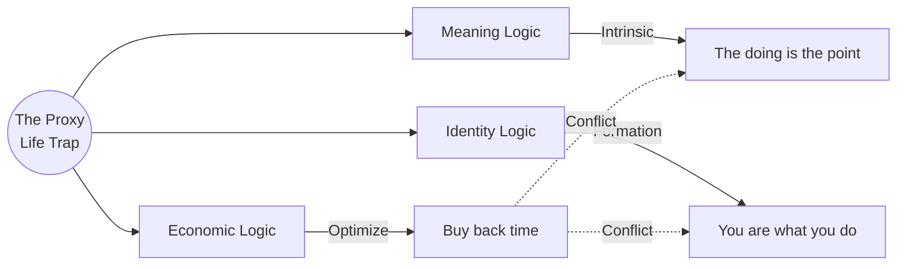

Welcome to the **Proxy Life Trap**:

> you work hard to fund the life you want, but the working consumes the life you're funding.

This is a rich paradox to explore.

## The Core Tension

There's a structural irony here: **delegation is sold as freedom, but it can quietly outsource your aliveness.** You hire someone to tend your garden, cook your food, raise your kids during the day, fix things around your farm — and in doing so, you trade the very friction and presence that makes life feel real.

The trap has layers:

- **Economic logic says**: specialize, earn more per hour, buy back time
- **Meaning logic says**: the doing *is* the point, not the outcome
- **Identity logic says**: you become what you repeatedly do — if others do it, who are you becoming?

This tension sits at the heart of [Economics for Life](/economics-for-life/) — the framework that borrows systems thinking to optimize life like a well-architected codebase. The economic logic is sound. But there's an antipattern it doesn't fully account for: **premature delegation** of the wrong tasks.

## Why Dreams Resist Delegation

Some things lose their essence the moment someone else does them:

- Growing your own food isn't about the food — it's about *relationship with cycles*
- Building something with your hands isn't about the object — it's about *embodied competence*
- Teaching someone isn't about the transfer of information — it's about *the mutual transformation*

These are **autotelic** experiences — their value is intrinsic to the doing, not the result. You can't pay someone to have your experience for you.

## The Hidden Cost of Optimization

Productivity culture treats time as a resource to be allocated. But meaning doesn't work that way. Meaning often lives in:

- **Inefficiency** — the struggle, the learning curve, the failure
- **Presence** — being somewhere fully, not managing it remotely
- **Irreplaceability** — doing something that only you, in your life, would do this way

When you optimize all the "low-value" tasks away, you can accidentally optimize away the texture of a life.

[Time Economics](/time-economics/) offers a useful corrective lens here: not all value is future value. Some of the highest-value time is **present value** — the irreplaceable moments that can't be deferred or replaced. A child's first steps. The smell of bread you made. The weight of something you built.

Optimizing purely for future value means missing the present value that makes the future worth arriving at.

## A Useful Distinction: Delegating *Burdens* vs. Delegating *Dreams*

Not all delegation is equal. There's a meaningful difference between:

| Delegate this | Keep this |
|---|---|
| Administrative noise | Craft and creation |
| Things you'd never choose | Things you'd do for free |
| Tasks with no learning left | Work that still surprises you |
| Logistics that drain presence | Processes that *require* your presence |

The question isn't "can someone do this better?" — it's **"does doing this make me more myself?"**

This maps directly to what [Time Economics](/time-economics/) calls **authorshipmetry** — the degree to which you're actively writing your story versus being written into someone else's. High-authorship time tends to be the time you're most present in, most challenged by, most alive within.

## Life Authorship as a Practice

A few principles worth anchoring to:

1. **Protect the irreducible** — identify 2-3 practices that are non-negotiable expressions of who you are. Guard them from optimization.
2. **Slow is a feature, not a bug** — in permaculture terms, "observe and interact" before you intervene. The same applies to life design. Don't abstract yourself away from your own land too fast.
3. **Beware the perpetual deferral** — "I'll do the things I love once I've built enough." That threshold tends to move. The life you want isn't behind the work — it needs to be *woven into* the work.
4. **Ask: who's living this?** — Periodically audit your week. How many hours did you spend inside experiences you'd choose, versus managing systems that supposedly exist to serve you?
5. **Meaning is made in contact** — with soil, with people, with problems, with your own limits. Delegation creates distance. Sometimes distance is relief. Sometimes it's loss.

## The AI Wildcard

The [Soulless Economy](/soulless-economy/) describes a future where AI agents do the cognitive heavy lifting — delegating not just logistics, but thinking itself. This is exciting and real. But it intensifies the proxy life question: if you delegate your creative process, your research, your problem-solving — what experience remains yours?

The answer probably isn't to refuse the tools. It's to be even more intentional about which experiences you protect. The autotelic ones. The irreducible ones. The ones that make you *more yourself*, not less.

Delegate the soulless tasks. Keep the ones with soul.
