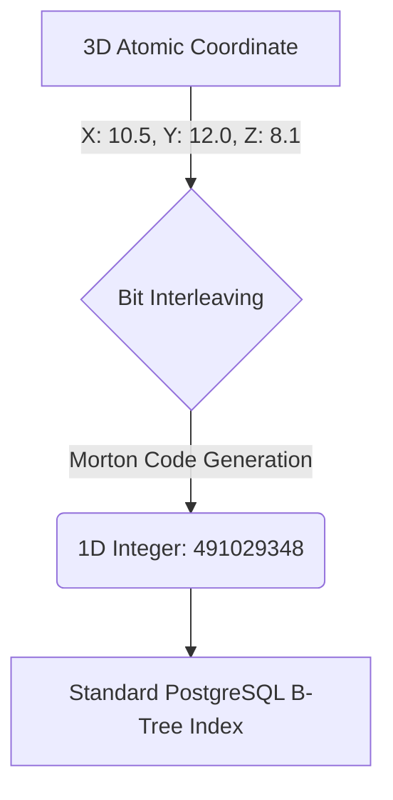

Biological data is fundamentally incompatible with traditional database architectures. 

When you sequence a genome, fold a protein in 3D space, or generate a high-dimensional AI vector using models like Meta's ESM-2, the resulting data is a nightmare to query. Modern bioinformatics usually relies on dumping thousands of flat text files (like `.pdb` or `.fasta`) onto a hard drive, then writing slow Python scripts using Pandas and Numpy to crunch the math in a massive `for` loop.

Today, we are changing that. We are releasing **`pg_bio`**: a hyper-optimized PostgreSQL extension written entirely in Rust. It pushes the heaviest biological mathematics deep into the database engine, transforming Postgres into a natively AI-aware bioreactor.

Here is why we built it, and how it solves the three fatal bottlenecks of computational biology.

---

## 1. The AI Vector Bottleneck (The I/O Problem)

When an AI model like ESM-2 analyzes a protein sequence, it generates a dense "embedding" (a massive array of floating-point numbers) that mathematically represents the protein's evolutionary function.

**The Traditional Approach:**
To find proteins similar to *Hemoglobin*, a standard Python script must fetch all 20,400 human proteins from the database, transmit gigabytes of float arrays over the TCP network, load them into RAM, and run cosine similarity calculations.

```mermaid
sequenceDiagram
    participant Python
    participant Network
    participant Postgres
    
    Python->>Network: "SELECT embedding FROM proteins;"
    Network->>Postgres: (Request Data)
    Postgres-->>Network: Transmitting 20,400 Arrays... 🔴 I/O BOTTLENECK
    Network-->>Python: (Receives Megabytes of Floats)
    Note over Python: Runs scipy.spatial.distance.cosine()
    Note over Python: Sorts and finds Top 5
```

**The `pg_bio` Approach:**
We implemented `embedding_cosine_distance(REAL[], REAL[])` natively in Rust. The calculation happens directly against the memory pages inside the database engine.

```mermaid
sequenceDiagram
    participant Python
    participant Postgres
    
    Python->>Postgres: "SELECT name FROM proteins ORDER BY distance LIMIT 5;"
    Note over Postgres: ⚡ Runs Cosine Math in Rust (C-level Memory)
    Postgres-->>Python: Returns exactly 5 rows (46 milliseconds)
```

**The Benchmark:** In our tests against the full UniProt Human Proteome, pushing the math down to the database was **6.4x faster** than the standard Numpy approach, strictly because it bypassed the network serialization penalty.

---

## 2. The 3D Spatial Bottleneck (The Math Problem)

Proteins are 3D machines. A common task is finding all atoms that sit within a specific "binding pocket" (e.g., a $5 \times 5 \times 5$ Ångstrom box). 

Traditionally, calculating distance requires checking the Euclidean equation $\sqrt{x^2 + y^2 + z^2}$ against *every single atom*. It is $O(N^2)$ brute force.

**The Z-Order B-Tree Solution:**
We created a custom `ResidueCoord` type in Postgres. We then built a function that takes the $X, Y, Z$ floats, interweaves their binary bits, and generates a **Morton Code (Z-Order Curve)**. 



This effectively compresses 3D physical space into a 1D line. You can now put a standard PostgreSQL B-Tree Index on the 3D atoms! 

```sql
EXPLAIN ANALYZE 
SELECT atom_id, (coord).name FROM protein_atoms
WHERE z_index BETWEEN residue_z_index(create_residue_coord(10, 10, 10, '')) 
                  AND residue_z_index(create_residue_coord(15, 15, 15, ''));
```

**The Benchmark:** Scanning a 200,000 atom protein for a binding pocket took exactly **7 milliseconds** via an Index Scan. No math was performed.

---

## 3. The Genomic Looping Bottleneck (The Attention Problem)

Deep learning models like the **Zhou Lab ORCA model** predict the 3D folding architecture of DNA. They output Hi-C Contact Maps: gigantic $N \times N$ matrices tracking which parts of the chromosome are physically touching each other (e.g., a Promoter looping back to touch a Gene).

These matrices are notoriously massive. To solve this, `pg_bio` introduces the `SparseAttentionMap` type.

```mermaid
graph LR
    A[ORCA Hi-C Output] -->|Compress to CSR| B(SparseAttentionMap)
    B -->|Stored Natively in pg_bio| C[(Postgres)]
    C -->|SQL: get_top_interacting_residues()| D[Find Promoter Loops]
```

By storing the contact map as a Compressed Sparse Row (CSR) structure natively in Postgres, we can write a simple SQL query to instantly ask the database: *"Which base pairs of this synthetic plasmid are physically wrapping around and touching the T7 Promoter in 3D space?"*

---

## Conclusion

By merging Rust, PostgreSQL, and PyTorch (via the Model Context Protocol), we haven't just built a database extension. We've built an autonomous, highly scalable operating system for synthetic biology. 

The days of moving biological data to the compute layer are over. With `pg_bio`, we are moving the compute directly to the data. 

*If you want to read about how we used this architecture to solve the 400-amino-acid limit on our Teflon-eating enzyme, check out [Part 7 of the TeaFlon Series](/synthetic-biology/2026/09/23/teaflon-synthetic-biology-part-7-pg-bio-and-local-ai.html).*
